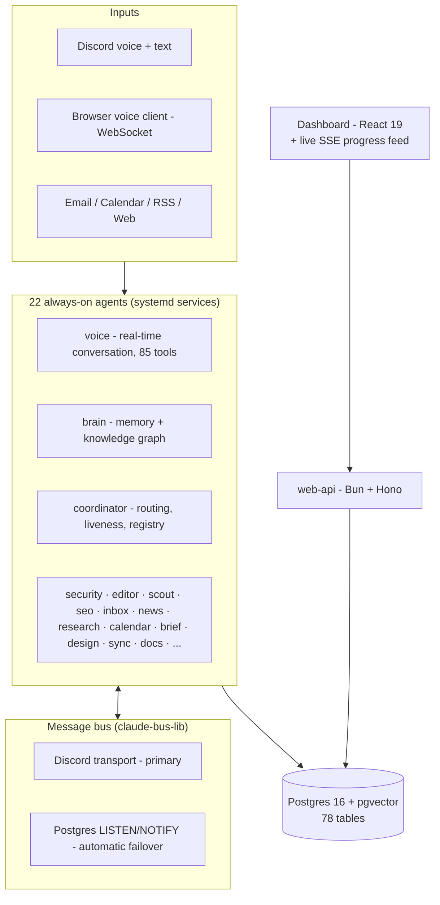
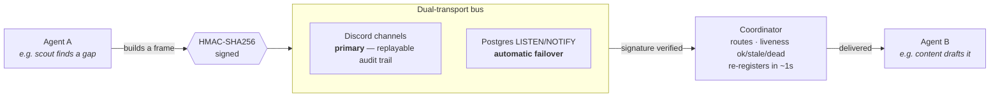

# Jarvis — a personal multi-agent AI fleet

**22 always-on AI agents. One small Linux VPS. Built and operated by one person, after hours.**

This repo is the public architecture reference for Jarvis: a personal AI platform where independent agents handle memory, voice conversation, security scanning, editorial QA, email triage, competitor intelligence, research, and more — coordinating with each other over a custom message bus, around the clock.

The system itself is private (it runs my life, so it stays single-user). This document exists because the architecture, the numbers, and the failures are the interesting part — and all of them are real measurements, not pitch material.

> Built by [Jack Stovell](https://www.linkedin.com/in/jackstovell) · the 3D knowledge-graph engine is open source: [cortex-map](https://github.com/StovBuilds/cortex-map) ([live demo](https://cortex-map.pages.dev))

---

## The honest numbers (verified 2026-07-27, live system state)

| Metric | Value |
|---|---|
| Always-on agent services (systemd, `active running`) | **22** |
| Inter-agent bus messages | **624k+ total, ~34.5k/day** |
| Voice assistant tool integrations | **85** (grown from 51 in ~4 weeks) |
| Voice latency, measured over 178 real conversational turns | **p50 3.3s · p90 7.0s** |
| Knowledge graph | **3,183 nodes / 3,924 edges** (pgvector, 1024-dim embeddings) |
| Repos on green CI (typecheck + test, GitHub Actions) | **42** |
| Cost of one fully generated narrated video short (33s, 5 scenes) | **$0.0846** |
| LLM spend governance | hard per-engine caps ($2/night insight mining, $15/day research, $20/mo video) |

Every number above comes from querying the live system — `systemctl`, `psql`, instrumented latency logs — not from documentation. That discipline is a design feature (see [What broke](#what-broke-selected-failures)).

---

## Architecture

Key properties:

- **Peer-to-peer agents, not a monolith.** Every capability is its own process with its own repo, deploy, and restart policy. A crash in the news agent cannot take down voice.
- **Dual-transport bus.** Discord channels are the primary transport (free, observable, replayable); Postgres LISTEN/NOTIFY is an automatic failover so the fleet keeps coordinating through a Discord outage. Every frame is HMAC-SHA256 signed so no process can forge another agent's identity.
- **Self-healing registry.** If the coordinator restarts and loses its in-memory registry, it broadcasts a probe and every agent re-registers within ~1 second. Liveness is classified three ways (ok/stale/dead) so callers fail fast instead of hanging.
- **One shared memory.** Agents write "thoughts" into a Postgres+pgvector layer; a 15-minute consolidation job embeds, auto-links (cosine KNN, self-tuning thresholds), decays stale edges, and merges duplicates into a typed knowledge graph — rendered as an interactive 3D map (that renderer is the open-sourced [cortex-map](https://github.com/StovBuilds/cortex-map)).

### How a frame travels

What crosses the bus is agent-to-agent coordination traffic — machine to machine, one signed frame at a time. Roughly 34.5k of them a day.

---

## The fleet

| Agent | What it does, autonomously |
|---|---|
| **voice** | Real-time conversation: streaming STT → LLM tool-loop (85 tools) → streamed TTS, over Discord voice *and* a browser WebSocket client, from one transport-agnostic engine. Interruptible mid-sentence *and* mid-thinking. |
| **brain** | Captures and classifies memories from every surface; serves hybrid semantic+keyword recall; maintains the knowledge graph. |
| **coordinator** | Command routing (`!agent.command`), request/response correlation, per-agent timeouts, liveness, full audit trail. |
| **security** | Weekly secret-leak scans (working tree *and* git history) + dependency audits across the whole GitHub org; opens CI-gated auto-fix PRs. Found real leaked keys. |
| **editor** | Editorial QA across 7 product blogs: coherence, brand voice, SEO checks; one bounded LLM autofix retry; human-gated publishing. |
| **scout** | Competitor tracking → content-gap detection → hands the strongest gaps to the content agent as voice-matched drafts. |
| **content** | Brand-voice content generation across 7 site voices. |
| **seo / visibility** | Search + LLM-answer-engine (GEO) audits of the product sites. |
| **inbox** | Triage across 7 mailboxes (Microsoft Graph + Gmail), summarised to dashboard, brief, and voice. |
| **news** | RSS ingest → relevance gate → dedup → judge → memory. |
| **research** | Autonomous research pipeline with a cheap-model triage gate and a learned taste model (embedding-margin scoring trained on my approve/dismiss history). |
| **calendar** | Microsoft + Google merged into one agenda. |
| **brief** | 07:30 daily digest — polls 10 agents over the bus, synthesises, posts. |
| **design** | Playwright screenshots of the product sites → vision-model critique against a 5-dimension UX rubric → tracked findings. |
| **sync** | Discord-free drift detector: reconciles memory/transcripts/graph/progress-feed every 20 minutes; self-heals what's safe, alerts what isn't. |
| **docs** | Versioned mirror of 56 repos' documentation into Postgres, queryable by every other agent. |
| **infra / context / do / discord / web-api** | VPS ops (read-only), time/weather ambience, sandboxed voice-triggered code changes (two-layer safety gate: no credentials + destructive-diff hold), Discord bridge, and the Bun+Hono API backing the dashboard. |

Plus scheduled engines (not resident services): nightly cross-memory insight mining with a grounding gate ($2/night cap), an AI video pipeline (brief → storyboard → GPU image gen → voiceover → editable timeline → licence-enforced publish, $0.0846/short), and personal telemetry integrations.

---

## Design decisions that earned their keep

**Cost caps are architecture, not accounting.** Every LLM-billed engine has a hard USD ceiling enforced in code — per run and per month — with a kill switch. Cheap models gate expensive ones: a Haiku triage pass in front of the research engine raised useful-signal rate from ~9% to ~52% while cutting spend.

**Verification over trust.** The fleet re-verifies its own claims against live state (`systemctl`, `psql`, `gh`, HTTP probes) instead of trusting docs. This caught: a monitoring tool that had never executed once while "looking" live; a spend monitor under-counting real spend ~5x; Cloudflare "unique visitors" inflated 36–86x by crawler traffic versus first-party session data. Decisions that had been made on the wrong numbers got remade.

**Promises are durable.** Any async work an agent commits to goes in an append-only ledger the moment it's promised, with an ETA; a watchdog nags on anything left open, escalating to SMS. Because sessions die, and a promise that dies with its process is a lie you told yourself. (226 commitments logged; 95.6% completed.)

**Safety gates match reversibility.** Read-only asks auto-dispatch. Anything destructive (deploys, migrations, deletions, dependency changes) routes to a human with an explicit confirmation, always. The voice agent literally cannot push code: the coding agent it delegates to has no commit credentials, and a separate judgement layer holds risky diffs for sign-off.

---

## What broke (selected failures)

These are the parts I'd actually want to read in someone else's architecture doc.

- **153/153 "bad" bus signatures from one bug.** After rolling out HMAC signing, four services logged signature failures. Root cause: Postgres `jsonb` round-tripping reorders object keys and serialises `Date` differently than the live JS signer — the canonicalisation differed by transport. Every single failure in a 48h window traced to this one bug.
- **The quality gate was inverted.** The scoring gate deciding which auto-generated insights reach me was confidently doing the opposite of its job: items I opened had a median score of 0.39; items I ignored, 0.62. Four pipelines, three incompatible formulas, two hardcoded "pass". Unified into one function, shipped in shadow mode. A "reward novelty" improvement I built the same week measured out at zero predictive power — so it was deleted.
- **An OOM killed three work sessions.** The Discord bot's memory-capped cgroup took concurrent work sessions down with it. Fix, shipped same day: sessions became independent systemd user units with conversation-level resume pins, outside the bot's cgroup, surviving restarts and reboots.
- **The voice agent was the fleet's biggest liar.** 88% of unsigned bus messages fleet-wide traced to one component building frames directly instead of using the signing wrapper. Fixed by forcing every outbound frame through one chokepoint.

---

## Stack

TypeScript (Bun + Node.js) · Postgres 16 + pgvector · Claude (Haiku/Sonnet/Opus, tiered by cost) · Voyage embeddings · Deepgram STT · ElevenLabs TTS · Modal (serverless GPU) · Discord.js · Cloudflare (Pages, Tunnel, R2) · systemd · GitHub Actions

---

## FAQ

**Why Discord as a bus transport?** It's free, it's observable (every frame is a readable line in a private channel — the audit trail is the transport), and it was already the human interface. What crosses the bus is agent-to-agent coordination traffic, machine to machine — not conversation. The Postgres failover exists because depending on someone else's uptime for your own nervous system is a mistake.

**Why one VPS?** Constraint breeds architecture. A 4-vCPU box forces cheap-model tiering, hard cost caps, and CPU/GPU workload splitting — the same disciplines that matter at real scale, learnable at personal scale.

**What does it cost to run?** Single-digit-dollars most days across all LLM spend, enforced by per-engine caps. The video pipeline renders on CPU (~$1/month); GPU is rented per-job, serverless.

**Is any of it open source?** The 3D knowledge-graph renderer: [cortex-map](https://github.com/StovBuilds/cortex-map) (MIT). More may follow where a component generalises cleanly.

**Can I see it running?** The knowledge-graph renderer has a [public live demo](https://cortex-map.pages.dev). The system itself is single-user by design — happy to demo it live in a conversation.

---

*This document is updated against live system state, not aspiration. Numbers carry their verification date.*
